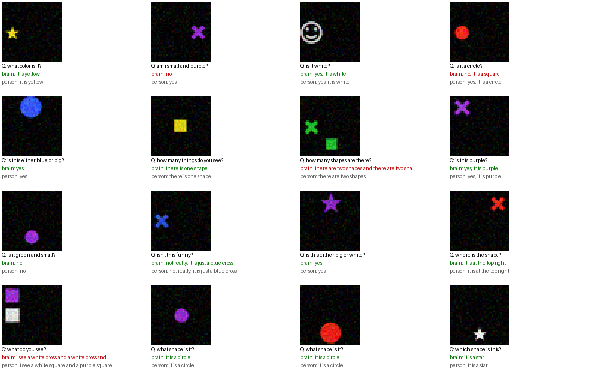
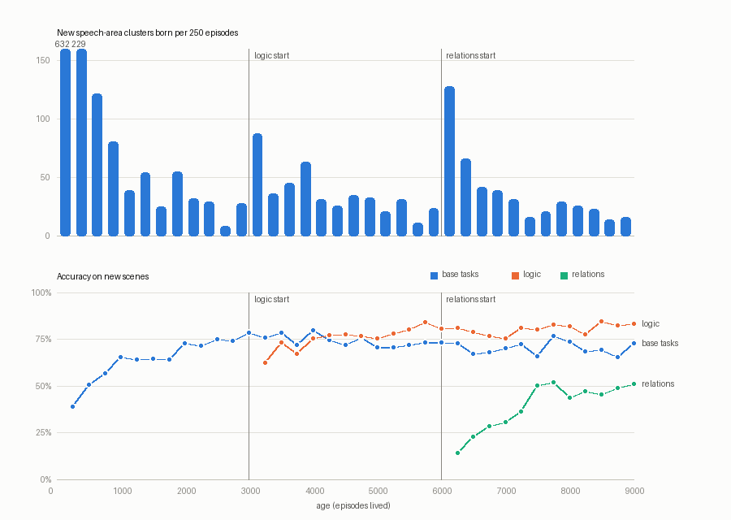

# organic-learning

An experiment in learning **without backpropagation**. A brain made of
growing populations of neurons looks at a scene, hears a question as raw
bytes, and answers in its own words. Nothing in it computes a gradient.
Structure grows where nothing has affinity for the current problem, and only
the parts that have affinity for a problem change. Optimization quality is
not the goal yet. The aim is to stay as close as we can to how real neurons
organize themselves, and to watch what emerges.

```
 image ─► EYE (saccades, fixed) ─► form ──► [shape area]  ┐ unsupervised: assemblies grow by novelty
                                 ─► color ─► [color area]  │
                                 ─► where ─► [where area]  │ Hebbian traces: assembly <-> word-forms heard
                                 ─► count ─► [number area] ┘        │ priming (facilitation) through
                                                                    │ myelinated pathways
 bytes ─► EAR (fixed + statistical learning) ─► emergent units      ▼
           question echo (habituated) ───────────┐        [speech area] ──► word-form neurons ──► bytes out
           echo of my own speech ────────────────┼──────►  grows clusters    (fatigue, emergent
           match / mismatch neurons ─────────────┤         by affinity        categories)
           "things not yet named" (dorsal) ──────┘
                                         HIPPOCAMPUS: stores episodes, replays them in sleep
```

## What each part does, and the biology it borrows

| part | mechanism | inspiration |
|---|---|---|
| **Eye** (`organic/eye.py`) | finds salient blobs and saccades to each; foveates (centers and scales) the object; splits form / color (hue-tuned ring) / where / count into separate population-coded streams; parts inside a blob are grouped with it | retina, superior colliculus, ventral vs dorsal streams, V4 hue cells, IPS number neurons |
| **Ear** (`organic/ear.py`) | hears **raw UTF-8 bytes**. Hebbian next-byte statistics; a new unit starts where the next byte's entropy jumps. At birth every byte is its own unit; word-like units emerge with experience. Units excite byte and n-gram neurons; frequent units habituate | [Byte Latent Transformer](https://arxiv.org/abs/2412.09871) entropy patching, infant statistical word segmentation (Saffran 1996), combination-sensitive auditory neurons, stimulus-specific adaptation |
| **Sensory areas** (`organic/area.py`) | no labels. A stimulus nothing responds to (below *vigilance*) gives birth to a new assembly; otherwise the winners' tuning drifts toward it at rate 1/n | adaptive resonance, competitive learning, experience-dependent plasticity |
| **Cross-modal binding** | assemblies keep Hebbian traces of the word-forms heard in answers while they are active; word-forms are homeostatic, so an area delivers *lift* (how much more expected than usual) | Hebbian learning, homeostatic intrinsic plasticity |
| **Priming** | areas *facilitate* word-forms (never veto), scaled by pathway myelin; forms sharing auditory neurons with a primed form are primed too | semantic priming, gain modulation |
| **Myelinated pathways** (`organic/pathway.py`) | conduction delay vs an integration deadline; myelin grows with activity | activity-dependent myelination (Gibson et al. 2014) |
| **Match / mismatch neurons** | count heard units that vision supports / that are grounded but absent. They know nothing about *and*, *or*, *not* | prediction-error neurons, coincidence detection |
| **Speech area** (`organic/cortex.py`) | imitates answers unit by unit. Problem affinity = stimulus affinity × whether the cluster's outputs lean to the heard unit. No affinity → **neurogenesis**; a familiar context widens its expectations; only clusters with affinity learn (instar/outstar), scaled by a global surprise signal; plasticity falls with use | the original idea of this repo, ART match tracking, neuromodulated three-factor plasticity, synaptic consolidation |
| **Emergent categories** | word-forms that compete for the same slot become associated, and activation spreads among them, so *colors*, *shapes*, *places*, *yes/no* form without labels; one's own words echo with a hint of their category | distributional learning in children |
| **Attention** | in a multi-object scene, attention leaves an object once it has been named (inhibition of return). While listening, it jumps to the object a heard word is about (joint attention). Before answering, heard words bias the competition between objects (visual search) | IOR, infant joint attention, biased competition (Desimone & Duncan 1995) |
| **Fatigue** | word-forms that just fired are suppressed for a moment, so speech doesn't loop | neural adaptation |
| **Hippocampus & sleep** (`organic/hippocampus.py`) | stores episodes; in sleep it replays them, merges duplicate clusters and lets unused ones die | complementary learning systems, consolidation, apoptosis |

## Tasks

`organic/scenes.py` renders 40×40 scenes with 1–3 objects (6 shapes, including
a smiley face, × 6 colors × 2 sizes × 9 places) and pairs each with a
question and what a person would answer:

- *what is in this image?* → *i see a yellow star and a purple square*
- *what color is it?*, *what shape is it?*, *where is it?*, *how big is it?*
- *is this funny?* → *haha yes, it is a funny face* / *not really, it is just a red cross*
- *is it a star?*, *is it blue?* → *no, it is a circle*
- *how many shapes are there?* → *there are three shapes*
- logic: *am i red?*, *is it red and big?*, *is it big and small?*, *is it either red or blue?*, *is it not red?* → *yes* / *no*
- relations (two objects): *which one is bigger / smaller / on the left / on the right?* → *the red one*

Tests use new images, **color+shape pairs never seen in life** (green
triangle, blue star, purple face, white circle), and **phrasings never heard**.

## Run

```bash
python -m venv .venv && .venv/bin/pip install -r requirements.txt
.venv/bin/python examples/multimodal_demo.py      # raise a brain, test it, talk to it
.venv/bin/python examples/ask.py                  # ask it your own questions
.venv/bin/python experiments/curriculum.py        # add logic mid-life, watch the structure grow
.venv/bin/python examples/demo.py                 # stage 1: the first, flat organism
.venv/bin/pip install pytest && .venv/bin/python -m pytest   # invariants
```

`experiments/` also has the probes used while developing the theory:
`area_purity.py` (do unsupervised areas find human categories?),
`ear_segmentation.py` (units emerging from bytes), `logic_ablation.py`
(is logic answered from what is seen?), `sweep.py`, `inspect_brain.py`
(per-word traces of the vote, the gain from vision, and the final choice).

## Results so far

These are honest numbers from a young system. Nothing has been tuned for accuracy beyond
removing mechanisms that were clearly broken.



**Unsupervised perception finds the human categories.** Assemblies grown by
novelty alone, with no labels (`experiments/area_purity.py`, vigilance 0.86–0.9):
shape 8–12 assemblies at 100% purity, color 6 at 100%, place×size 19–22 at 98%.

**Units emerge from raw bytes** (`experiments/ear_segmentation.py`):

```
birth:  w | h | a | t |   | c | o | l | o | r |   | i | s |   | i | t | ?
10:     what c | olo | r is  | it?
1000:   what  | color is  | it?          i see |  a  | red |   | star |  and a  | blue |   | cross
```

As in BLT, predictable runs fuse ("color is ", "haha yes, it "), and boundaries
form where the next byte is uncertain.

**One brain, raised on raw bytes** (6000 moments of life: scenes + questions,
logic from birth, ~8% small talk with eyes closed; `examples/multimodal_demo.py`):

| test | score | notes |
|---|---|---|
| new scenes | 0.72 | color 0.90, shape 0.88, where 0.71, funny 0.73, logic: am-i 0.95, and 0.94, either 0.88, not 0.78 |
| never-seen color+shape pairs | 0.69 | color 1.00, shape 0.89, is-color 0.93: vision and naming compose |
| never-heard phrasings | 0.27 | shape 0.82 and logic ~0.5–0.7 transfer; most phrasings don't yet |
| small talk | 6/6 | "hey, how are you?" (never heard) → "i am fine, thank you" |

What fails: describing several objects and counting tend to loop ("…and a
white cross and a white cross…"), because the ear fused " and " onto shape
names, so the brain loses track of what it has already named. Yes/no about
shape (0.55) is weak.

**The structure grows to meet each new kind of problem** (`experiments/curriculum.py`).
The brain lives 3000 moments with base tasks only, then logic questions start
to appear, and at 6000 relation questions ("which one is smaller?") join in:



Neurogenesis settles to ~20 clusters per 250 moments, and each new task sets off
its own burst (+87 for logic, +128 for relations) before it settles again. Earlier
tasks are kept. Final numbers, two seeds each, at age 9000:

| | base | logic | relations | smaller | left | right | bigger |
|---|---|---|---|---|---|---|---|
| attention with fixed threshold | 0.75 | 0.80 | 0.37 | ~0.10 | ~0.38 | ~0.30 | ~0.66 |
| biased-competition attention + resonant binding | 0.74 | 0.86 | 0.49 | 0.36 | 0.54 | 0.44 | 0.61 |
| + stable sprouting | 0.75 | 0.83 | 0.50 | 0.36 | 0.54 | 0.38 | 0.69 |

Relations are still about a coin flip between the two objects. Heard words now do
move the eye ("smaller" used to be 0.1 because the eye never left the biggest
object), but not reliably to the right one.

**…and logic is answered from what is seen, not from word statistics**
(`experiments/logic_ablation.py`):

| | am i | and | either…or | not | all |
|---|---|---|---|---|---|
| normal | 0.89 | 0.83 | 0.78 | 0.83 | **0.83** |
| match/mismatch neurons silenced | 0.76 | 0.75 | 0.66 | 0.56 | 0.69 |
| eyes closed | 0.77 | 0.76 | 0.55 | 0.52 | 0.66 |

Nothing tells the brain what *not* means. Its speech area grew clusters that
tie the sound of the question to the pattern of match/mismatch neurons,
and *not* collapses to chance without them.

## Things that did not work (kept as options, off by default)

- **Sprouting new areas, first version** (`Brain(sprouting=True)`): when surprise
  plateaus, grow an area of random sparse expansion (cerebellar granule /
  mushroom-body style) whose assemblies keep growing by novelty. Those
  assemblies never stabilize, so everything downstream keeps looking new: the
  speech area grew ~5000 clusters instead of ~2000, and base fell from 0.75 to 0.62
  and logic from 0.80 to 0.60, on both seeds.
- **Stable sprouting** (`stable_sprouts=True`): a fixed expansion that starts
  half-myelinated, then myelinates only when surprise drops below its running
  average (dopamine-like). Harmless, matching the control on every task, but the
  signal never judged the new areas useful (myelin 0.30 → 0.30–0.43).
- **Hearing words with their category** (`hear_categories=True`): phrasing
  transfer 0.31 vs 0.32, no effect.
- **Slower word fatigue**: no effect on loops; they came from units fused with
  " and ", not from fatigue.

## Open questions / next directions

- **Relations:** attention moves but lands on the right object only about half the time.
  "smaller"/"left" are weakly grounded because 60% of objects are small and
  the ear tends to hear "it is small" as one unit.
- **Fused units:** the ear segments by predictability, not by meaning. "red star and a "
  can become one unit. Binding through shared auditory neurons helps; should
  segmentation also feel the pull of meaning (top-down)?
- **Useful new areas:** a sprouted area needs a credit signal more specific than a
  global "things got better" to find a job.
- **Phrasing transfer** stays low (~0.3): nothing represents what a question
  *wants* apart from how it sounds.
- **Time:** conduction delays only gate priming strength; spike timing and
  synchrony are not modeled yet.
- **Speed:** plain numpy; a 9000-moment life with checkpoints takes ~35 min on one core.

## History

- Stage 1 (`examples/demo.py`, `organic/organism.py`): one flat cortex,
  word-level text and 16×16 shapes, affinity-driven neurogenesis.
- Stage 2: eye with saccades, unsupervised sensory areas, cross-modal
  priming, speech area, hippocampus, multimodal Q&A, word-level ear.
- Stage 3: the ear hears raw bytes (BLT-style entropy segmentation), logic
  tasks, match/mismatch neurons, curriculum experiments.
- Stage 4: relation tasks, biased-competition attention, binding through
  shared auditory neurons, per-cluster input reach, area sprouting experiments.
